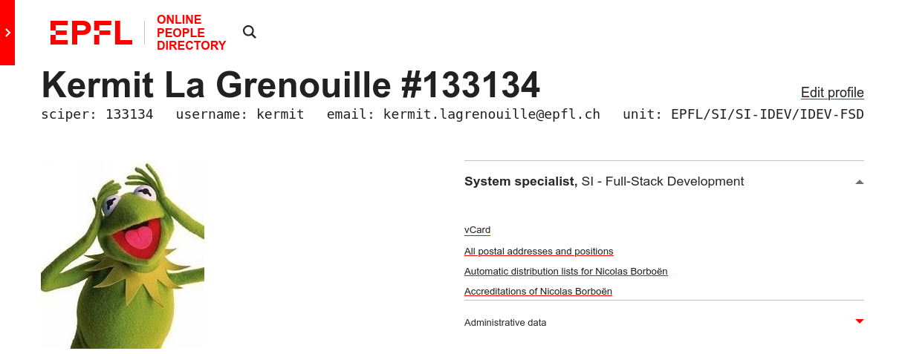

# EPFL People UserScript
<!-- TOC titleSize:2 tabSpaces:3 depthFrom:1 depthTo:6 withLinks:1 updateOnSave:1 orderedList:0 skip:1 title:0 charForUnorderedList:* -->
* [Installation](#installation)
* [Features](#features)
   * [On search.epfl.ch](#on-searchepflch)
   * [On people.epfl.ch](#on-peopleepflch)
* [Example](#example)
<!-- /TOC -->

A user script to improve browsing on [search.epfl.ch] and [people.epfl.ch].

## Installation

1. Install [Greasemonkey](https://addons.mozilla.org/en-US/firefox/addon/greasemonkey/) (Firefox),  [Tampermonkey](http://tampermonkey.net/) or [Violentmonkey](https://violentmonkey.github.io/);
1. Open the RAW content of [EPFL_People.user.js](https://raw.githubusercontent.com/ponsfrilus/EPFL_People_UserScript/master/EPFL_People.user.js);
1. Install and enable the script;
1. Enjoy new features while browsing [people.epfl.ch](http://people.epfl.ch), e.g. [169419](http://go.epfl.ch/nbo).

## Features

### On search.epfl.ch

   * Add the sciper number next to the person's name

### On people.epfl.ch

   * Add the sciper number next to the person's name
   * Auto-load the login page if not logged
   * Toggle the admin data information
   * Display information such as sciper, username, email and unit just below the person's name

## Example

[search.epfl.ch]: https://search.epfl.ch
[people.epfl.ch]: https://people.epfl.ch